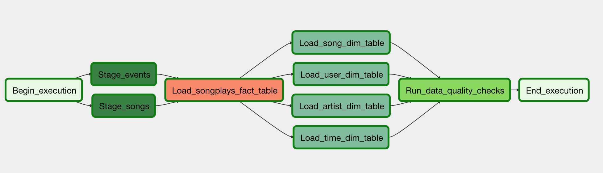

# Project Summary

This project demonstrates loading data that resides in S3 on to a staging environment in Redshift Cluster.  The pipleline to load various data is defined in Airflow.

# Project Description

In this project, for a music streaming company called Sparkfy, the song data and the log data reside in S3 bucket.  In order for the business analysts and data analysts
to get insight in to the users' listening habits and preferences, these data need to be loaded and transformed into different structures called fact and dimension tables.  For this purpose, we use star schema consisting of 1 Fact and 4 Dimension tables as follows:

## Fact Table

1. songplays

## Dimension Tables

1. songs

2. artists

3. users

4. time

# Implementation Logic

There are two dag files, one for doing the preliminary preparation work like dropping and creating required tables, before running the main dag
In the main dag we invoke various operators in appropriate sequence using Airflow sequencing/pipelining concept.  Following are the two dag files used for this purpose

1. create_tables_dag.py   - Preliminary Dag

2. dag - the main dag that does the actual loading/pipelining the data

After all the data are loaded in appropriate fact and dimension tables, a data quality is ensured by running DataQualityOperator

The following picture shows that all the opeators are executed successfully without any errors:

# Required Settings in Airflow

1. Create aws_credentials

  a. Conn Id : aws_credentials
  
  b. Conn Type : Amazon Web Services
  
  c. Login : AWS Access Key for the IAM user
  
  d. Password: AWS Access Secret Key
  

2. Create redshift connection details

  a. Conn Id : redshift
  
  b. Conn Type : Postgres
  
  c. Host : Redshift Cluster Endpoint url
  
  d. user : IAM User with admin previleges
  
  e. password : redshift db user password
  
  f. host : 5439
